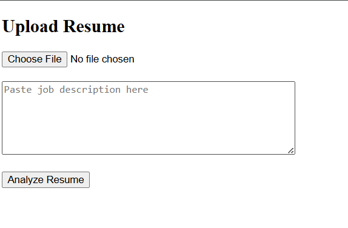
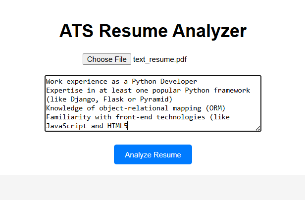
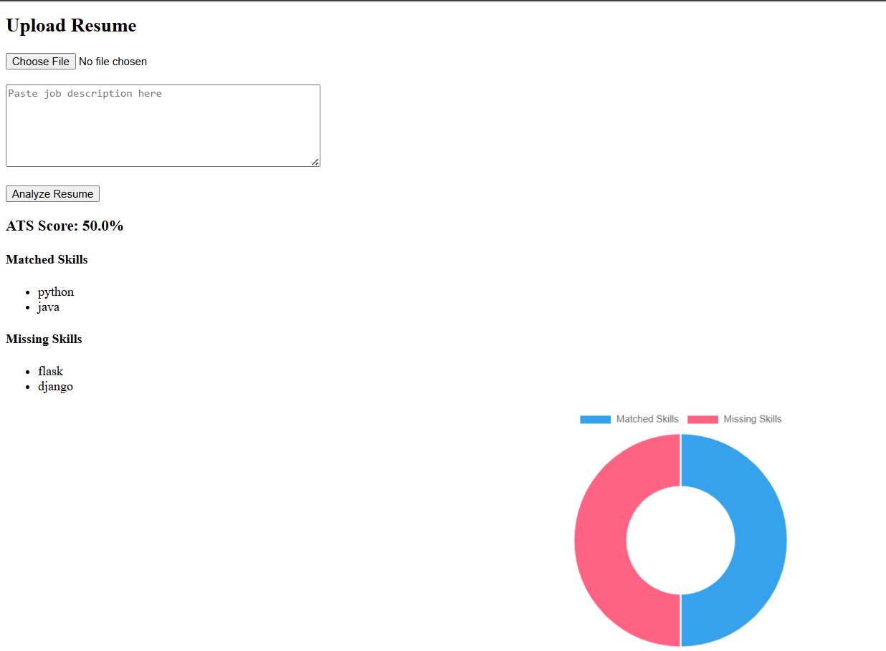
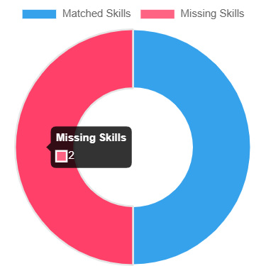

# ATS Resume Analyzer using python

A web application that analyzes resumes and compares them with job descriptions to calculate an ATS (Applicant Tracking System) compatibility score.

Live Demo:
https://ats-resume-analyzer-gtnq.onrender.com

## Why This Project?

Many resumes get rejected by Applicant Tracking Systems (ATS) before reaching recruiters due to missing or mismatched skills.

This project was built to simulate how ATS systems evaluate resumes and to help users understand:
- Which skills match a job description
- Which important skills are missing
- How well their resume aligns with a role

---

## What Makes This Project Different?

Unlike basic resume keyword checkers, this project:

- Provides a clear ATS compatibility score
- Identifies both matched and missing skills
- Visualizes results using charts for better understanding
- Offers a simple web interface for real-time analysis

---

## Tech Stack

Backend:
Python
Flask

Libraries:
PyPDF2
Chart.js

Tools:
Git
GitHub
Render (for deployment)

## How It Works

1. User uploads a resume PDF.
2. User enters a job description.
3. The system extracts text from the resume.
4. Skills are detected from the resume.
5. Job description skills are identified.
6. ATS score is calculated based on skill matching.
7. Results are displayed with charts.

## Installation (Run Locally)

Clone the repository:

git clone https://github.com/rakshithanagella14-eng/ats-resume-analyzer.git

Go into the project folder:

cd ats-resume-analyzer

Install dependencies:

pip install -r requirements.txt

Run the application:

python main.py

Open in browser:

http://127.0.0.1:5000

## Project Screenshots

### Home Page

### Resume Upload

### ATS Analysis Result

### ATS Analysis chart

## Future Improvements

- Support DOCX resume format
- Advanced NLP skill detection
- Resume suggestions for improvement
- Multiple job comparison

## Development Note

This project was built in a short time frame to simulate rapid prototyping and iterative development. 

The commit history reflects continuous improvements, debugging, and feature additions, similar to real-world development workflows.

## Author

Nagella Rakshitha